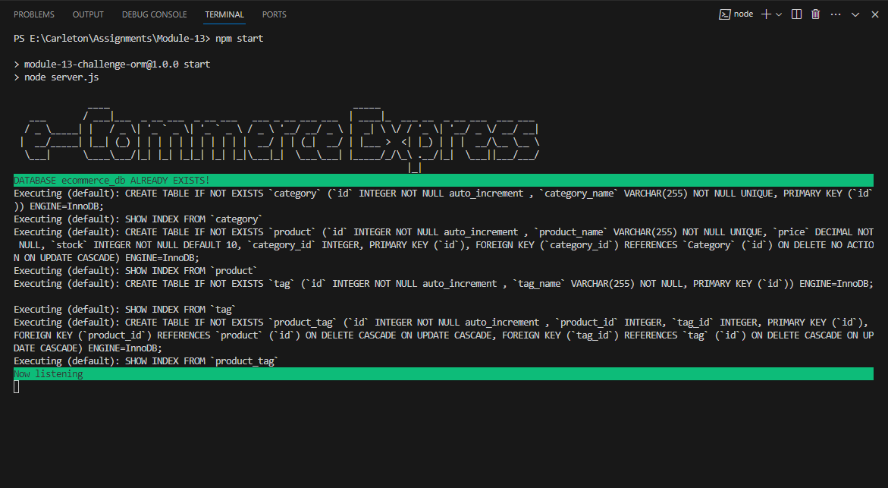
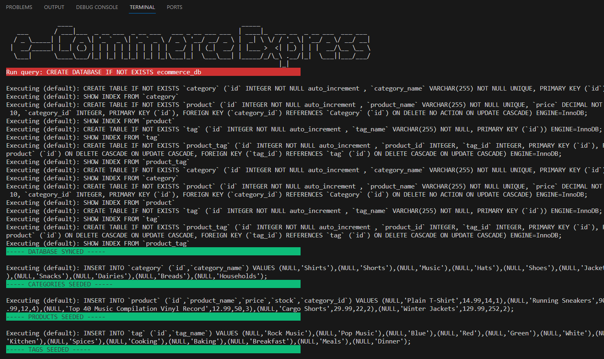
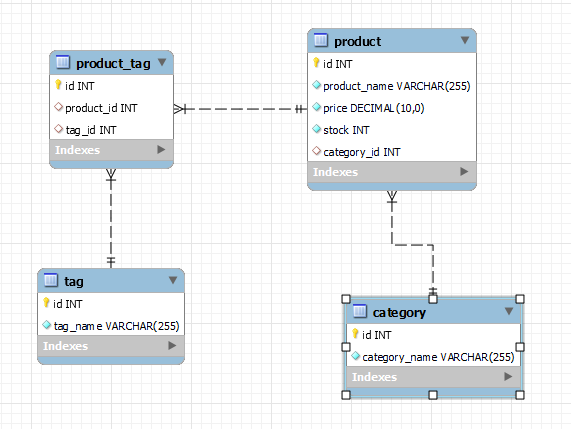
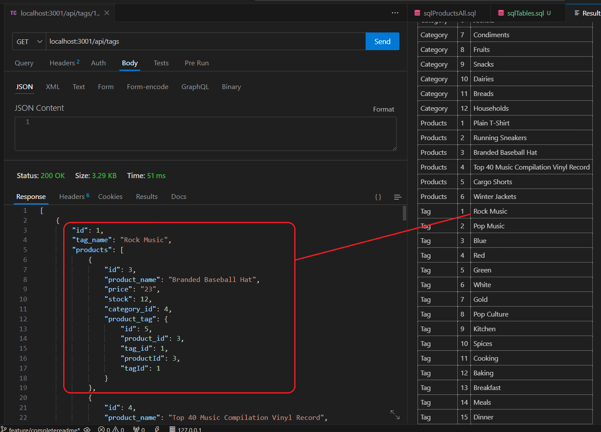
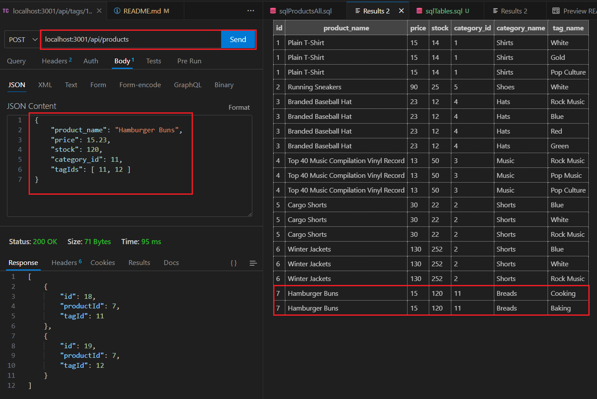

<a id="readme-top" name="readme-top"></a>

<p align="center"></p>

<p align="center" style="margin-top:25px; margin-bottom:50px;">
	<a href="https://developer.mozilla.org/en-US/docs/Web/javascript"></a>
	<a href=""></a>
	<a href="https://en.wikipedia.org/wiki/MIT_License"></a>
</p>

# Carlton Coding Bootcamp Certification

<details style="margin-bottom: 25px; margin-top: 25px;">
	<summary>Table of Contents</summary>
	<ol>
		<li><a href="#Description">E-Commerce Application</a></li>
		<li><a href="#installation">Installation</a></li>
		<li><a href="#technology">Technology Stack</a></li>
		<li><a href="#database">eCommerce Database</a></li>		
		<li><a href="#usage">Application Usage</a></li>
		<li><a href="#contactme">Questions? Contact Me!</a></li>
		<li><a href="#license">License</a></li>
	</ol>
</details>

<div id="Description" style="margin-top: 25px;">

## E-Commerce Application

The assignment description starts <span style="color:lightblue"><i>"Internet retail, also known as **e-commerce**, plays a significant role within the electronics industry, as it empowers businesses and consumers alike to conveniently engage in online buying and selling of electronic products"</i></span>. I could not agree more with this openning statement, it is a winning statement.

As developers and throughout our careers we will encounter many opportunities to build applications that would be implemented either in -in-house hosted servers or on the cloud. I know this because, this is what I have done for the past 27 year in my career, acting as a, #Systems Analyst #Developer #DBA and more. The most important step in the process, is to demonstrate the client, that we can handle the database. Databases, can get out of control very easy, so we need to spend as much time as possible in developing the right model.

This assignment allows us to put in practice what we have learned. Not just by achieving what is asked in the requirements, but to go beyond; use our imagination. There is much room for improvements on this template eCommerce Application.

As developers we should always name our applications, I have called my application <span style="color:orange">"eCommerce Express"</span>. Here is my product!

   <div style="margin-top: 15px;">
      
   </div>

<details style="margin-top:25px;">
<summary>When using the eCommerce Express application it is more likely that database does not exist. The application does a validation when loading to ensure we have the database and to avoid having a two-step initial process.</summary>

<div style="margin-top: 15px;">
	
</div>
<p align="center" style="margin-top:10px;">The process detects database is missing and it creates it!</p>
</details>

</div>

<p align="right">(<a href="#readme-top">back to top</a>)</p>

<div id="installation" style="margin-bottom: 20px;margin-top: 20px;">

## Installation

1. Install Node 18 or later. You can use the package managerof your choice.
2. Clone this repository : `git clone git@github.com:gusmiller/ORM-ECommerce.git`
3. Run `npm i` to install the dependencies.
4. Run `npm start` to start the API server.
5. When you run the application for the first time, database will be creaed.

**Important Note**: you must have MySQL installed and configured in your computer, you will need a root user and a regular user. We also recommend you install MySQL Workbench. MySQL is developed by Oracle you can download a free version from their [website](https://dev.mysql.com/doc/mysql-installation-excerpt/5.7/en/). To install MySQL follow this [installation guide](https://coding-boot-camp.github.io/full-stack/mysql/mysql-installation-guide). You will also need to install [npm dotenv](https://www.npmjs.com/package/dotenv), Dotenv is a zero-dependency module that loads environment variables from a .env file into process.env.

Once you have completed the configuration of MySQL then you can run manually the db/schema.sql -which contains NO data, this is to create the eCommerce_db. To run the process using MySQL CLI trigger the following command to initialize the databse. Ultimately you can also create the database using MySQL Workbench

```
	mysql -u root -p
	source db/schema.sql
```

The seeding of the tables will be performed by the application through Sequelize npm package.

Dependancies included in the package.json:

```
    chalk version 4.1.2
    dotenv version 8.2.0
    express version 4.17.1
    figlet version 1.7.0
    mysql2 version 2.1.0
    sequelize version 5.21.7
	nodemon version 2.0.3 (development - optional)
```
</div>

<p align="right">(<a href="#readme-top">back to top</a>)</p>

<div id="technology" style="margin-top: 25px;">

## Technology Stack

The following should list any major frameworks/libraries used to in the designing and coding of **eCommerce Express Application**.
This section  bootstrap your project. Leave any add-ons/plugins for the acknowledgements section. Here are a few examples.

* <a href="https://www.npmjs.com/package/chalk"></a> Make message colorful and pleasing to the eye
* <a href="https://www.mysql.com/products/workbench/"></a> MySQL Server and Workbench application
* <a href="https://www.npmjs.com/package/dotenv"></a> Dotenv environment variables
* <a href="https://www.npmjs.com/package/express"></a> The Express philosophy is to provide small, robust tooling for HTTP servers, making it a great solution for single page applications, websites, hybrids, or public HTTP APIs.
* <a href="https://www.tsql.info/"></a> Transac-SQL language to retrieve data from database - JOIN queries, Nested and aggregate queries 
* <a href="https://developer.mozilla.org/en-US/docs/Web/javascript"></a> Use Javascript as the main language - used classes and module exports.
* <a href="https://developer.mozilla.org/en-US/docs/Web/mysql2"></a> MySQL2 project is a continuation of MySQL-Native. Protocol parser code was rewritten from scratch and api changed to match popular mysqljs/mysql. 

<p align="right">(<a href="#readme-top">back to top</a>)</p>

<div id="database" style="margin-top: 25px;">

## eCommerce database

The eCommerce database - hosted on <span style="color:cyan">Oracle MySQL</span> is relatively simple, it contains 4 tables implemented with simple relationships to ensure data integrity. Also known as referential integrity. Tables and fields have been created using **Sequelize ORM** standard naming conventions. Primary keys are using in this case autoincremental numeric fields.

The following image shows the database model for the eCommerce Database:

<div style="margin-right:30px;margin-top: 15px;">
	<p align="center"></p>
</div>

**NOTE**: Here is an example on how we can improve the requirements by implementing features that could make the model more robust! To prevent data duplication, I have introduced the UNIQUE attribute to the name in tables; Category and Products. This was NOT in the Assignment requirements.

<p align="right">(<a href="#readme-top">back to top</a>)</p>

<div id="usage" style="margin-top: 25px;">

## Application Usage

The eCommerce Express Application is a simple yet powerfull ExpressJS application, with much space for growth. Because of that, the usage is pretty simple, since it all revolves into one objective - the clients Products. First the database environment has to be configured and initialize but, thanks to NPM Equelizer package, this task is very simple. 

Launching the eCommerce Express for the first time:
1. Follow the steps listed in the "<a href="#installation">Installation</a>" section in this manual.
2. Launch the application from a terminal window - `npm start` this will  start the API server and listen for calls.

Once the eCommerce Express server running it should be listening on: localhost:3001

Though the application is simple, still, it requires a bit of technical knwoledge. We must be familiar with applications such Postman, SoapUI, RapidAPI or Thunder Client, which allow us to retrieve information from our Applications Endpoints. There are 4 main type of calls -called EndPoints, that we can use to retrieve data from eCommerce Express database, these are as follow: GET, POST, PUT & DELETE.

For the demo I have used Thunder Client, which is embedded into my developing environment. Next, we will review each of the End points:

### GET Enpoint

<details>
<summary>The GET Endpoints are the simpler ones. Enter the localhost:3001/api/tags or localhost:3001/api/categories or localhost:3001/api/products, and a list of items will be returned. In case we like retrieve just 1 record then we add /{id} and if there is a match it will return the record.</summary>
 
 <div style="margin-right:30px;margin-top: 15px;">
	<p align="center"></p>
</div>

</details>

### POST Enpoint

<details>
<summary>The POST Endpoints are used to create a new record; Categories, Tags and Products. Tihs Endpoint requires a bit more work; we need to provide the new record on JSON format and we must provide all required information.</summary>
 
 <div style="margin-right:30px;margin-top: 15px;">
	<p align="center"></p>
</div>

</details>

### DELETE/PUT Enpoints
These Endpoints are basic, there isn't much to show. We need to know the Key ID of the table we are searching for, but don't let that intimidate you, jump into it! try it yourself.

<p align="right">(<a href="#readme-top">back to top</a>)</p>

</div>

<div id="contactme" style="margin-top: 25px;">

## Questions? Contact Me 

The purpose of this eCommerce Express Application is to build a database driven Express API. The application has potential for much expansion and it can become something special.

Do not hesitate in contacting me, Gustavo Miller - gustavo.miller@miller-hs.com.

You may find the application at: [https://github.com/gusmiller/ORM-ECommerce](https://github.com/gusmiller/ORM-ECommerce)

<p align="right">(<a href="#readme-top">back to top</a>)</p>

</div>


<div id="license" style="margin-top: 25px;">

## License

MIT License

Copyright (c) 2023 Gustavo Miller - OntarioTECK VBA Developers

### eCommerce Express Application

Permission is hereby granted, free of charge, to any person obtaining a copy of this software and associated documentation files (the "Software"), to deal in the Software without restriction, including without limitation the rights to use, copy, modify, merge, publish, distribute, sublicense, and/or sell copies of the Software, and to permit persons to whom the Software is furnished to do so, subject to the following conditions:

The above copyright notice and this permission notice shall be included in all copies or substantial portions of the Software.

THE SOFTWARE IS PROVIDED "AS IS", WITHOUT WARRANTY OF ANY KIND, EXPRESS OR IMPLIED, INCLUDING BUT NOT LIMITED TO THE WARRANTIES OF MERCHANTABILITY, FITNESS FOR A PARTICULAR PURPOSE AND NONINFRINGEMENT. IN NO EVENT SHALL THE AUTHORS OR COPYRIGHT HOLDERS BE LIABLE FOR ANY CLAIM, DAMAGES OR OTHER LIABILITY, WHETHER IN AN ACTION OF CONTRACT, TORT OR OTHERWISE, ARISING FROM, OUT OF OR IN CONNECTION WITH THE SOFTWARE OR THE USE OR OTHER DEALINGS IN THE SOFTWARE.

<a></a>

<p align="right">(<a href="#readme-top">back to top</a>)</p>

</div>

---
© 2023 edX Boot Camps LLC. Confidential and Proprietary. All Rights Reserved. Developed by Gustavo Miller